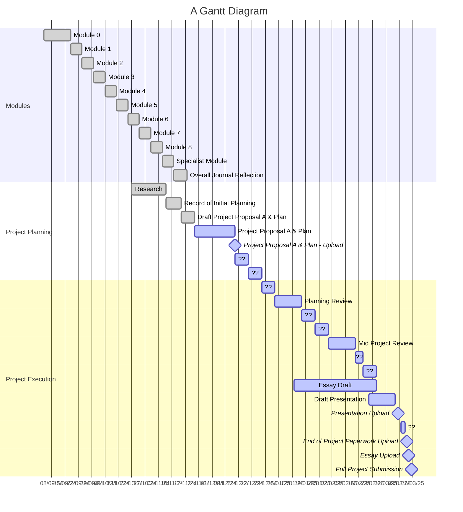
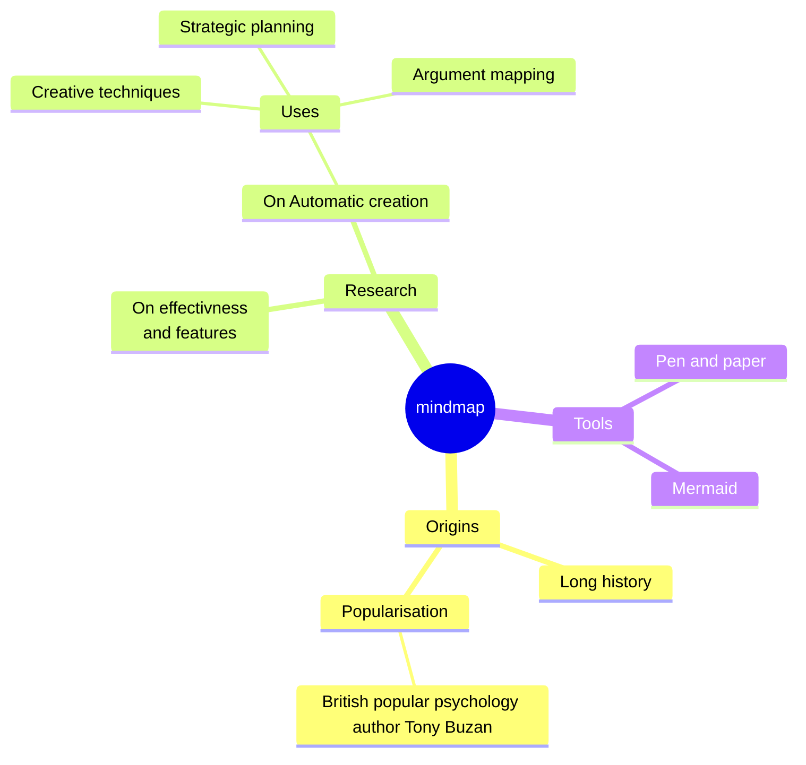
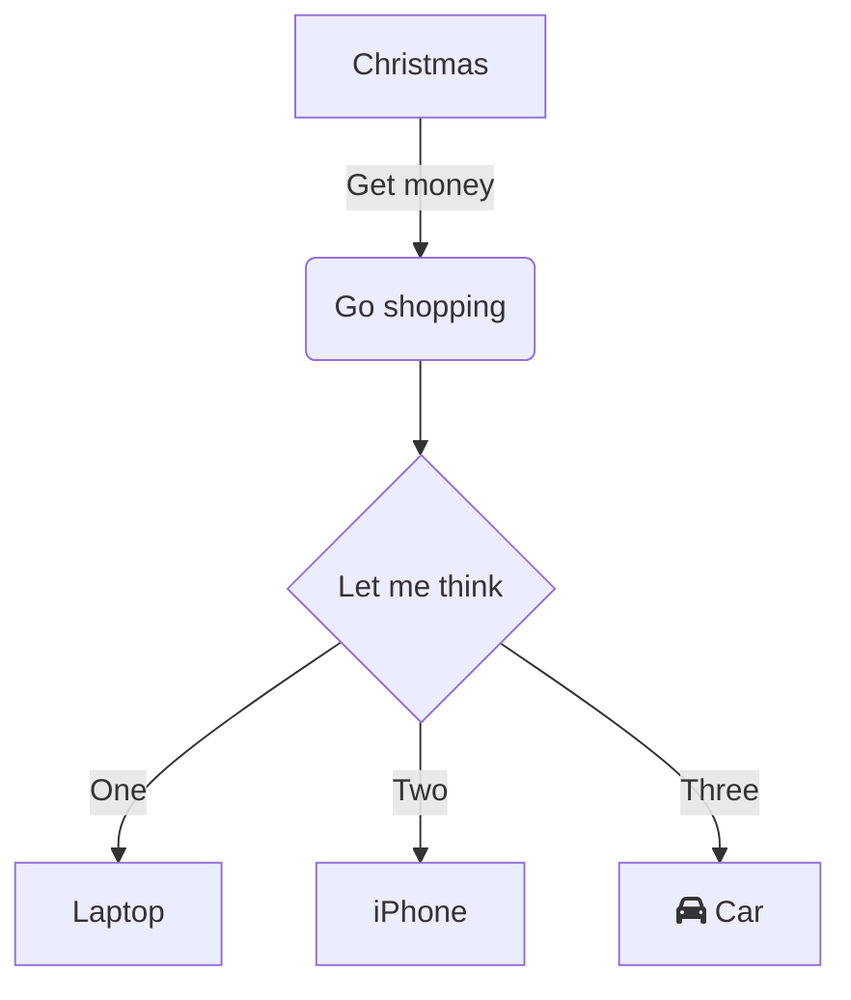

## Gantts from todo lists

- [x] Module 0 📅 04/09/2024 ✅ 2024-12-19
- [ ] Module 1 ⏳  6days

Module 2         :done,  6d

Module 3         :done,  6d

Module 4         :done,  6d

Module 5         :done,  6d

Module 6         :done,  6d

Module 7         :done,  6d

Module 8         :done,  6d

Specialist Module:done,  6d

Overall Journal Reflection:done, 18/11/2024

section Project Planning

Research : done, 20/10/2024, until roip

Record of Initial Planning      :done, roip, 07/11/2024, 15/11/2024

Draft Project Proposal A & Plan :done, dppa, 15/11/2024, 22/11/2024

Project Proposal A & Plan :active, ppa, after dppa , until ppau

Project Proposal A & Plan - Upload:active, milestone, ppau, 13/12/2024, 13/12/2024

?? : active, 7d

?? : active, 7d

section Project Execution

?? : active, 7d

Planning Review      : active, 17/01/2025

?? : active, 7d

?? : active, 7d

Mid Project Review : active, 14/02/2025

?? : active, 4d

?? : active, 7d

Essay Draft: active, 13/01/2025, 25/02/2025

Draft Presentation: active, 21/02/2025, 07/03/2025

Presentation Upload:milestone, active, 10/03/2025

?? : active,2d

End of Project Paperwork Upload:milestone, active, 14/03/2025

Essay Upload:milestone, active, 14/03/2025

Full Project Submission:milestone, active, 17/03/2025

 

  

## Mindmap

  

  

## Flowchart

  

