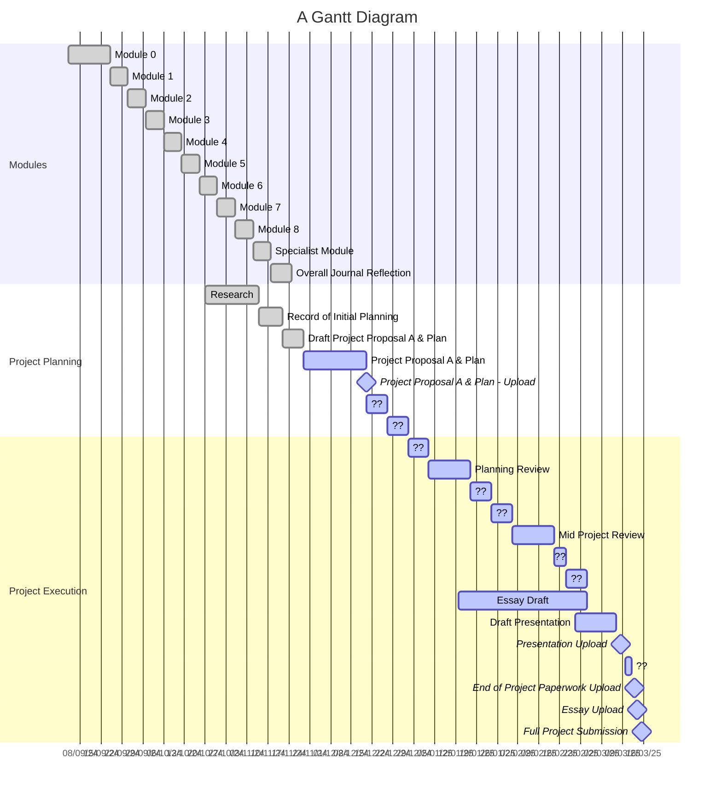
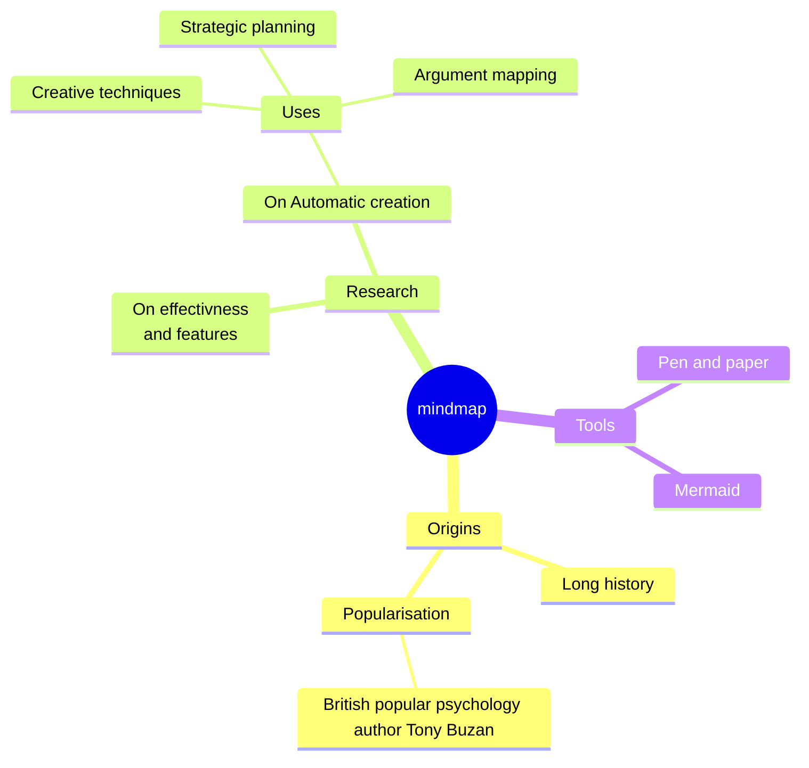
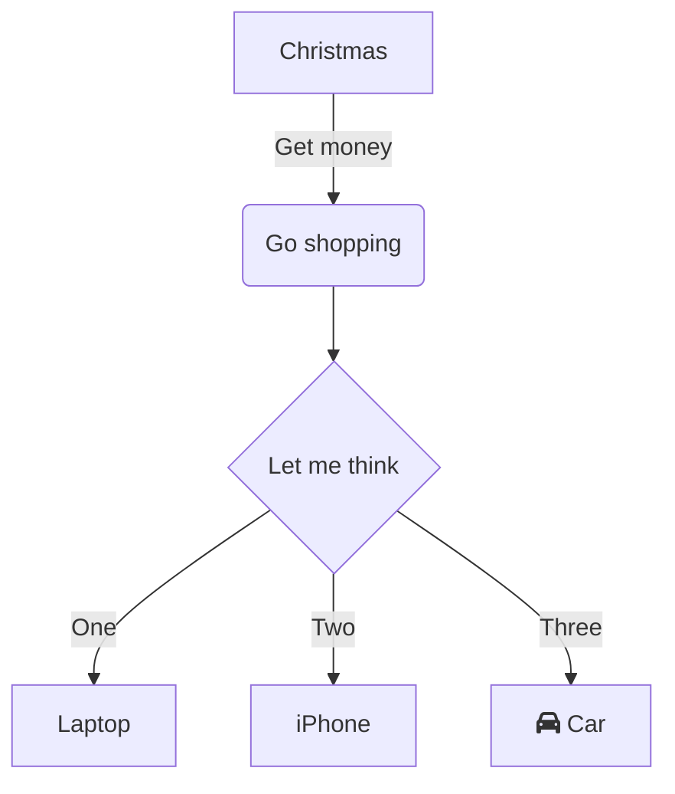

## Gantt Current Version
 

```mermaid

gantt

    title A Gantt Diagram

    dateFormat  DD/MM/YYYY

    axisFormat %d/%m/%y

    tickInterval 1week

  

    section Modules

    Module 0         :done,     m0, 04/09/2024, 14d

    Module 1         :done,  6d

    Module 2         :done,  6d

    Module 3         :done,  6d

    Module 4         :done,  6d

    Module 5         :done,  6d

    Module 6         :done,  6d

    Module 7         :done,  6d

    Module 8         :done,  6d

    Specialist Module:done,  6d

    Overall Journal Reflection:done, 18/11/2024

    section Project Planning

    Research : done, 20/10/2024, until roip

    Record of Initial Planning      :done, roip, 07/11/2024, 15/11/2024

    Draft Project Proposal A & Plan :done, dppa, 15/11/2024, 22/11/2024

    Project Proposal A & Plan :active, ppa, after dppa , until ppau

    Project Proposal A & Plan - Upload:active, milestone, ppau, 13/12/2024, 13/12/2024

    ?? : active, 7d

    ?? : active, 7d

  

    section Project Execution

    ?? : active, 7d

    Planning Review      : active, 17/01/2025

    ?? : active, 7d

    ?? : active, 7d

    Mid Project Review : active, 14/02/2025

    ?? : active, 4d

    ?? : active, 7d

    Essay Draft: active, 13/01/2025, 25/02/2025

    Draft Presentation: active, 21/02/2025, 07/03/2025

    Presentation Upload:milestone, active, 10/03/2025

    ?? : active,2d

    End of Project Paperwork Upload:milestone, active, 14/03/2025

    Essay Upload:milestone, active, 14/03/2025

    Full Project Submission:milestone, active, 17/03/2025

  

```

  

## Mindmap

  

```mermaid

mindmap
  root((mindmap))
    Origins
      Long history
      ::icon(fa fa-book)
      Popularisation
        British popular psychology author Tony Buzan
    Research
      On effectivness<br/>and features
      On Automatic creation
        Uses
            Creative techniques
            Strategic planning
            Argument mapping
    Tools
      Pen and paper
      Mermaid
```

  

## Flowchart

  

```mermaid

flowchart TD

    A[Christmas] -->|Get money| B(Go shopping)

    B --> C{Let me think}

    C -->|One| D[Laptop]

    C -->|Two| E[iPhone]

    C -->|Three| F[fa:fa-car Car]

```