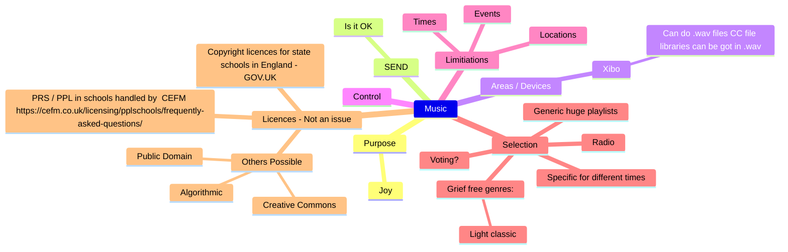

PRS / PPL in schools handled by  CEFM https://cefm.co.uk/licensing/pplschools/frequently-asked-questions/

We have PPL & PRS Public performance licences through the DfE.  [Copyright licences for state schools in England - GOV.UK](https://www.gov.uk/guidance/copyright-licences-information-for-schools) . So we can play background music of any source. Spotify is also allowed but there might some nuance about accounts etc.

