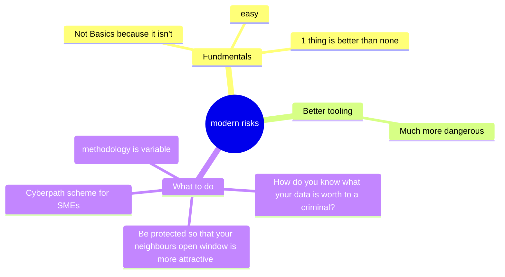
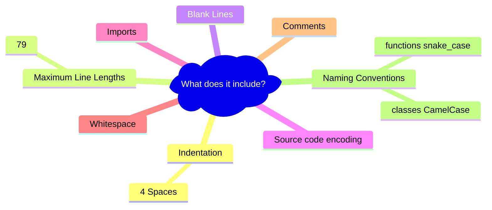

[[UTC OLP Python Style Guide]]

[[What does it include]]

```mermaid
mindmap
  root((modern risks))
    Fundmentals
      Not Basics because it isn't 
      easy
      1 thing is better than none
    Better tooling 
      Much more dangerous 
    What to do
      How do you know what your data is worth to a criminal?
      Be protected so that your neighbours open window is more attractive 
      Red Teaming is attacking the whole organisation not just Pen Testing (methodology is variable )
      Cyberpath scheme for SMEs
      


```

```mermaid
mindmap
	root)What does it include\?(
		Indentation
			4 Spaces
		Maximum Line Lengths
			79
		Blank Lines
		Source code encoding
		Imports
		Whitespace
		Comments
		Naming Conventions
			functions snake_case
			classes CamelCase
```