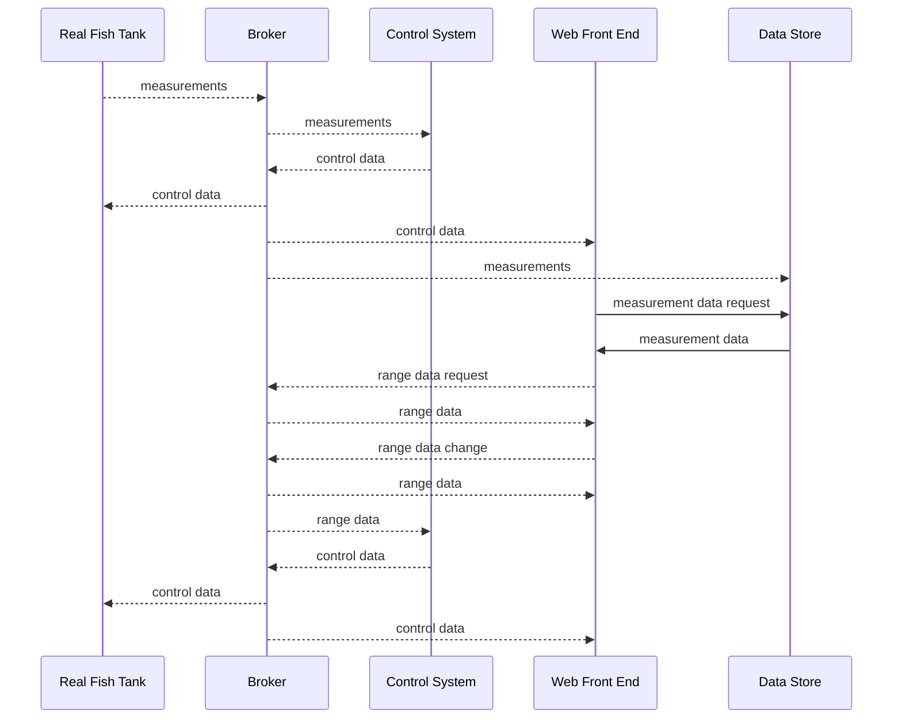

## Real Fish Tank System

But because of Pub Sub we can use other arrangements for demos etc.

The kids write a Control System that starts subbed to a simulation with a visualisation that it subbed to the simulation too. runs at 60  timespeed*
