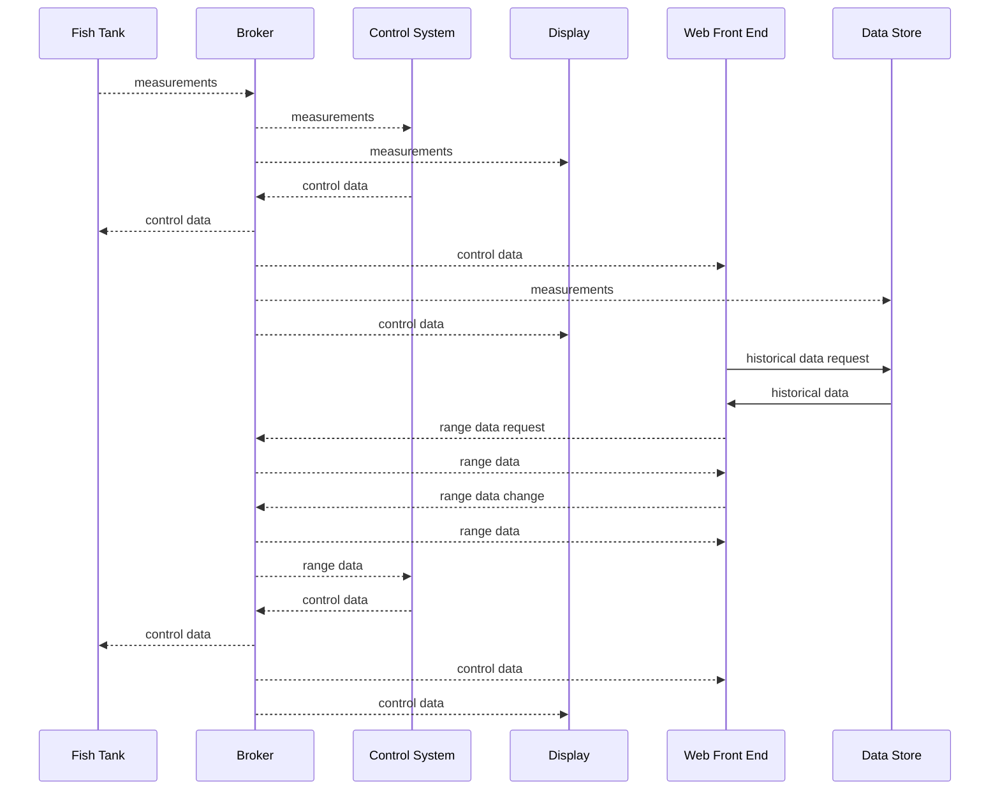
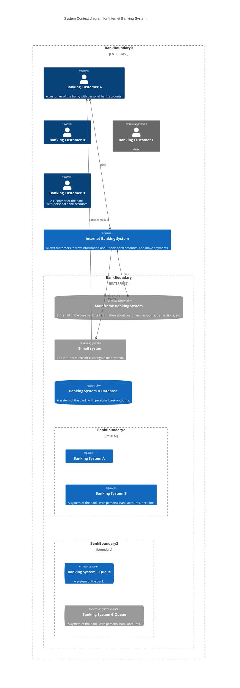

## Fish Tank System Definitions

### MQTT
[MQTT]([MQTT - The Standard for IoT Messaging](https://mqtt.org/)) is an OASIS standard messaging protocol for the Internet of Things (IoT). It is designed as an extremely lightweight publish/subscribe messaging transport that is ideal for connecting remote devices with a small code footprint and minimal network bandwidth. MQTT today is used in a wide variety of industries, such as automotive, manufacturing, telecommunications, oil and gas, etc.


### Fish Tank
A tank with fish in which we are trying to monitor and control. But this could a real one, a demo one with robot fish or an entirely simulated one. All of these will be MQTT Clients. 

It sends out measurements and recieves control data that it uses to turn on the heater etc.
### Measurements
Measurement of temperature acidity etc sent from a Fish Tank
### Control Data
Should the heater be on or off etc.
### Range data
What are the target ranges for measurements in the system.
### Control System 
An MQTT Client program that subscribes to the measurement, range and optionally the control data of a fish tank and decides what the control data should be and changes it,
### Display 
An MQTT Client program that subscribes to the measurement and control data of a fish tank and shows the current status of the system.
### Historical data
Stored data for graphing etc.
### Data Store
Server where the data is stored. It subscribes to the MQTT data and records all data from messages.
### Front End
A program containing a Display, range editing capability and optionally , graphing from the data store.




But because of Pub/Sub we can use other arrangements for demos etc.

The kids write a Control System that starts subbed to a simulation with a display that it subbed to the simulation too. runs at 60  times speed. 

The fake tank can be attached to the control data of one of the simulated tanks.

A control system can then be subbed to the fake tank measurements and really take over.


```mermaid


```


