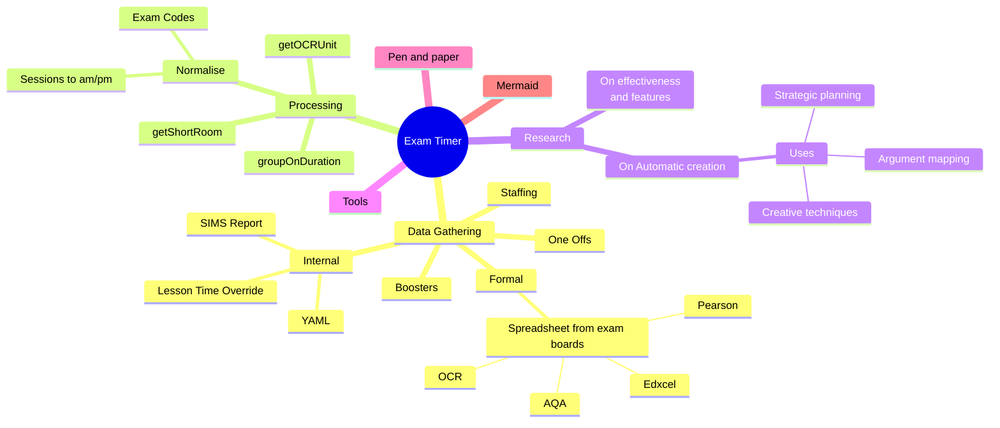

# Business Need

- Display exam details for mock and formal exams at UTC Sheffield Sites and an accurate clock on display screens.
- Show upcoming exams on other display screens
- Do it based on the report from SIMS and the exam board excel sheets
- Booster timing and locations
- Make the exam support staffs life easier with knowing where and when things are needed, with out getting in the way.

# Missing features

- Multi site
- SIMS file uploads
- Static build ?
- Validation
- Sticky but tweakable exam length in the timer
- Automated / assisted fetching of exam board spreadsheets
- Consistent layout
- Single start time by default
- Adhoc Timer
- Exam and booster times for each day of a season rendered to images for powerpoint?
- What rooms and exams today / tomorrow one page view
- Reader & Writer tracking

# Current Features

