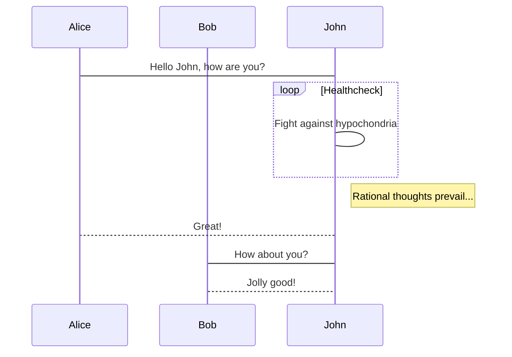

### svgbob

```svgbob
                  .-,(  ),-.
   ___  _      .-(          )-.
  [___]|=| -->(                )      __________
  /::/ |_|     '-(          ).-' --->[_...__... ]
                  '-.( ).-'
                          \      ____   __
                           '--->|    | |==|
                                |____| |  |
                                /::::/ |__| 
                            
```


### vega

```vega
{
  "$schema": "https://vega.github.io/schema/vega/v5.json",
  "description": "A population pyramid showing U.S. demographics from 1850 to 2000.",
  "height": 400,
  "padding": 5,
  "signals": [
    { "name": "chartWidth", "value": 300 },
    { "name": "chartPad", "value": 20 },
    { "name": "width", "update": "2 * chartWidth + chartPad" },
    { "name": "year", "value": 2000,
      "bind": {"input": "range", "min": 1850, "max": 2000, "step": 10} }
  ],

  "data": [
    {
      "name": "population",
      "url": "data/population.json"
    },
    {
      "name": "popYear",
      "source": "population",
      "transform": [
        {"type": "filter", "expr": "datum.year == year"}
      ]
    },
    {
      "name": "males",
      "source": "popYear",
      "transform": [
        {"type": "filter", "expr": "datum.sex == 1"}
      ]
    },
    {
      "name": "females",
      "source": "popYear",
      "transform": [
        {"type": "filter", "expr": "datum.sex == 2"}
      ]
    },
    {
      "name": "ageGroups",
      "source": "population",
      "transform": [
        { "type": "aggregate", "groupby": ["age"] }
      ]
    }
  ],

  "scales": [
    {
      "name": "y",
      "type": "band",
      "range": [{"signal": "height"}, 0],
      "round": true,
      "domain": {"data": "ageGroups", "field": "age"}
    },
    {
      "name": "c",
      "type": "ordinal",
      "domain": [1, 2],
      "range": ["#d5855a", "#6c4e97"]
    }
  ],

  "marks": [
    {
      "type": "text",
      "interactive": false,
      "from": {"data": "ageGroups"},
      "encode": {
        "enter": {
          "x": {"signal": "chartWidth + chartPad / 2"},
          "y": {"scale": "y", "field": "age", "band": 0.5},
          "text": {"field": "age"},
          "baseline": {"value": "middle"},
          "align": {"value": "center"},
          "fill": {"value": "#000"}
        }
      }
    },
    {
      "type": "group",

      "encode": {
        "update": {
          "x": {"value": 0},
          "height": {"signal": "height"}
        }
      },

      "scales": [
        {
          "name": "x",
          "type": "linear",
          "range": [{"signal": "chartWidth"}, 0],
          "nice": true, "zero": true,
          "domain": {"data": "population", "field": "people"}
        }
      ],

      "axes": [
        {"orient": "bottom", "scale": "x", "format": "s", "title": "Females"}
      ],

      "marks": [
        {
          "type": "rect",
          "from": {"data": "females"},
          "encode": {
            "enter": {
              "x": {"scale": "x", "field": "people"},
              "x2": {"scale": "x", "value": 0},
              "y": {"scale": "y", "field": "age"},
              "height": {"scale": "y", "band": 1, "offset": -1},
              "fillOpacity": {"value": 0.6},
              "fill": {"scale": "c", "field": "sex"}
            }
          }
        }
      ]
    },
    {
      "type": "group",

      "encode": {
        "update": {
          "x": {"signal": "chartWidth + chartPad"},
          "height": {"signal": "height"}
        }
      },

      "scales": [
        {
          "name": "x",
          "type": "linear",
          "range": [0, {"signal": "chartWidth"}],
          "nice": true, "zero": true,
          "domain": {"data": "population", "field": "people"}
        }
      ],

      "axes": [
        {"orient": "bottom", "scale": "x", "format": "s", "title": "Males"}
      ],

      "marks": [
        {
          "type": "rect",
          "from": {"data": "males"},
          "encode": {
            "enter": {
              "x": {"scale": "x", "field": "people"},
              "x2": {"scale": "x", "value": 0},
              "y": {"scale": "y", "field": "age"},
              "height": {"scale": "y", "band": 1, "offset": -1},
              "fillOpacity": {"value": 0.6},
              "fill": {"scale": "c", "field": "sex"}
            }
          }
        }
      ]
    }
  ]
}
```


### vegalite

```vega-lite
{
  "$schema": "https://vega.github.io/schema/vega-lite/v4.json",
  "description": "A diverging stacked bar chart for sentiments towards a set of eight questions, displayed as percentages with neutral responses straddling the 0% mark",
  "data": {
    "values": [
      {"question": "Question 1", "type": "Strongly disagree", "value": 24, "percentage": 0.7},
      {"question": "Question 1", "type": "Disagree", "value": 294, "percentage": 9.1},
      {"question": "Question 1", "type": "Neither agree nor disagree", "value": 594, "percentage": 18.5},
      {"question": "Question 1", "type": "Agree", "value": 1927, "percentage": 59.9},
      {"question": "Question 1", "type": "Strongly agree", "value": 376, "percentage": 11.7},
      {"question": "Question 2", "type": "Strongly disagree", "value": 2, "percentage": 18.2},
      {"question": "Question 2", "type": "Disagree", "value": 2, "percentage": 18.2},
      {"question": "Question 2", "type": "Neither agree nor disagree", "value": 0, "percentage": 0},
      {"question": "Question 2", "type": "Agree", "value": 7, "percentage": 63.6},
      {"question": "Question 2", "type": "Strongly agree", "value": 11, "percentage": 0},
      {"question": "Question 3", "type": "Strongly disagree", "value": 2, "percentage": 20},
      {"question": "Question 3", "type": "Disagree", "value": 0, "percentage": 0},
      {"question": "Question 3", "type": "Neither agree nor disagree", "value": 2, "percentage": 20},
      {"question": "Question 3", "type": "Agree", "value": 4, "percentage": 40},
      {"question": "Question 3", "type": "Strongly agree", "value": 2, "percentage": 20},
      {"question": "Question 4", "type": "Strongly disagree", "value": 0, "percentage": 0},
      {"question": "Question 4", "type": "Disagree", "value": 2, "percentage": 12.5},
      {"question": "Question 4", "type": "Neither agree nor disagree", "value": 1, "percentage": 6.3},
      {"question": "Question 4", "type": "Agree", "value": 7, "percentage": 43.8},
      {"question": "Question 4", "type": "Strongly agree", "value": 6, "percentage": 37.5},
      {"question": "Question 5", "type": "Strongly disagree", "value": 0, "percentage": 0},
      {"question": "Question 5", "type": "Disagree", "value": 1, "percentage": 4.2},
      {"question": "Question 5", "type": "Neither agree nor disagree", "value": 3, "percentage": 12.5},
      {"question": "Question 5", "type": "Agree", "value": 16, "percentage": 66.7},
      {"question": "Question 5", "type": "Strongly agree", "value": 4, "percentage": 16.7},
      {"question": "Question 6", "type": "Strongly disagree", "value": 1, "percentage": 6.3},
      {"question": "Question 6", "type": "Disagree", "value": 1, "percentage": 6.3},
      {"question": "Question 6", "type": "Neither agree nor disagree", "value": 2, "percentage": 12.5},
      {"question": "Question 6", "type": "Agree", "value": 9, "percentage": 56.3},
      {"question": "Question 6", "type": "Strongly agree", "value": 3, "percentage": 18.8},
      {"question": "Question 7", "type": "Strongly disagree", "value": 0, "percentage": 0},
      {"question": "Question 7", "type": "Disagree", "value": 0, "percentage": 0},
      {"question": "Question 7", "type": "Neither agree nor disagree", "value": 1, "percentage": 20},
      {"question": "Question 7", "type": "Agree", "value": 4, "percentage": 80},
      {"question": "Question 7", "type": "Strongly agree", "value": 0, "percentage": 0},
      {"question": "Question 8", "type": "Strongly disagree", "value": 0, "percentage": 0},
      {"question": "Question 8", "type": "Disagree", "value": 0, "percentage": 0},
      {"question": "Question 8", "type": "Neither agree nor disagree", "value": 0, "percentage": 0},
      {"question": "Question 8", "type": "Agree", "value": 0, "percentage": 0},
      {"question": "Question 8", "type": "Strongly agree", "value": 2, "percentage": 100}
    ]
  },
  "transform": [
    {
      "calculate": "if(datum.type === 'Strongly disagree',-2,0) + if(datum.type==='Disagree',-1,0) + if(datum.type =='Neither agree nor disagree',0,0) + if(datum.type ==='Agree',1,0) + if(datum.type ==='Strongly agree',2,0)",
      "as": "q_order"
    },
    {
      "calculate": "if(datum.type === 'Disagree' || datum.type === 'Strongly disagree', datum.percentage,0) + if(datum.type === 'Neither agree nor disagree', datum.percentage / 2,0)",
      "as": "signed_percentage"
    },
    {"stack": "percentage", "as": ["v1", "v2"], "groupby": ["question"]},
    {
      "joinaggregate": [
        {
          "field": "signed_percentage",
          "op": "sum",
          "as": "offset"
        }
      ],
      "groupby": ["question"]
    },
    {"calculate": "datum.v1 - datum.offset", "as": "nx"},
    {"calculate": "datum.v2 - datum.offset", "as": "nx2"}
  ],
  "mark": "bar",
  "encoding": {
    "x": {
      "field": "nx",
      "type": "quantitative",
      "axis": {
        "title": "Percentage"
      }
    },
    "x2": {"field": "nx2"},
    "y": {
      "field": "question",
      "type": "nominal",
      "axis": {
        "title": "Question",
        "offset": 5,
        "ticks": false,
        "minExtent": 60,
        "domain": false
      }
    },
    "color": {
      "field": "type",
      "type": "nominal",
      "legend": {
        "title": "Response"
      },
      "scale": {
        "domain": ["Strongly disagree", "Disagree", "Neither agree nor disagree", "Agree", "Strongly agree"],
        "range": ["#c30d24", "#f3a583", "#cccccc", "#94c6da", "#1770ab"],
        "type": "ordinal"
      }
    }
  }
}

```

### vega wordcloud

```vega
{  
  "$schema": "https://vega.github.io/schema/vega/v5.json",
  "width": 800,
  "height": 400,
  "padding": 0,
  "data": [
    {
      "name": "table",
      "values": [
        "Declarative  visualization grammars can accelerate development, facilitate retargeting across platforms, and allow language-level optimizations. However, existing declarative visualization languages are often concerned with visual encoding, and rely on imperative event handlers for interactive behaviors. In response, we introduce a model of declarative interaction design for data visualizations. Adopting methods from reactive programming, we model low-level events as composable data streams from which we form higher-level semantic signals. Signals feed predicates and scale inversions, which allow us to generalize interactive selections at the level of item geometry (pixels) into interactive queries over the data domain. Production rules then use these queries to manipulate the visualization’s appearance. To facilitate reuse and sharing, these constructs can be encapsulated as named interactors: standalone, purely declarative specifications of interaction techniques. We assess our model’s feasibility and expressivity by instantiating it with extensions to the Vega visualization grammar. Through a diverse range of examples, we demonstrate coverer over an established taxonomy of visualization interaction techniques.",
        "We present Reactive Vega, a system architecture that provides the first robust and comprehensive treatment of declarative visual and interaction design for data visualization. Starting from a single declarative specification, Reactive Vega constructs a dataflow graph in which input data, scene graph elements, and interaction events are all treated as first-class streaming data sources. To support expressive interactive visualizations that may involve time-varying scalar, relational, or hierarchical data, Reactive Vega’s dataflow graph can dynamically re-write itself at runtime by extending or pruning branches in a data-driven fashion. We discuss both compile- and run-time optimizations applied within Reactive Vega, and share the results of benchmark studies that indicate superior interactive performance to both D3 and the original, non-reactive Vega system.",
        "We present Vega-Lite, a high-level grammar that enables rapid specification of interactive data visualizations. Vega-Lite combines a traditional grammar of graphics, providing visual encoding rules and a composition algebra for layered and multi-view displays, with a novel grammar of interaction. Users specify interactive semantics by composing selections. In Vega-Lite, a selection is an abstraction that defines input event processing, points of interest, and a predicate function for inclusion testing. Selections parameterize visual encodings by serving as input data, defining scale extents, or by driving conditional logic. The Vega-Lite compiler automatically synthesizes requisite data flow and event handling logic, which users can override for further customization. In contrast to existing reactive specifications, Vega-Lite selections decompose an interaction design into concise, enumerable semantic units. We evaluate Vega-Lite through a range of examples, demonstrating succinct specification of both customized interaction methods and common techniques such as panning, zooming, and linked selection."
      ],
      "transform": [
        {
          "type": "countpattern",
          "field": "data",
          "case": "upper",
          "pattern": "[\\w']{3,}",
          "stopwords": "(i|me|my|myself|we|us|our|ours|ourselves|you|your|yours|yourself|yourselves|he|him|his|himself|she|her|hers|herself|it|its|itself|they|them|their|theirs|themselves|what|which|who|whom|whose|this|that|these|those|am|is|are|was|were|be|been|being|have|has|had|having|do|does|did|doing|will|would|should|can|could|ought|i'm|you're|he's|she's|it's|we're|they're|i've|you've|we've|they've|i'd|you'd|he'd|she'd|we'd|they'd|i'll|you'll|he'll|she'll|we'll|they'll|isn't|aren't|wasn't|weren't|hasn't|haven't|hadn't|doesn't|don't|didn't|won't|wouldn't|shan't|shouldn't|can't|cannot|couldn't|mustn't|let's|that's|who's|what's|here's|there's|when's|where's|why's|how's|a|an|the|and|but|if|or|because|as|until|while|of|at|by|for|with|about|against|between|into|through|during|before|after|above|below|to|from|up|upon|down|in|out|on|off|over|under|again|further|then|once|here|there|when|where|why|how|all|any|both|each|few|more|most|other|some|such|no|nor|not|only|own|same|so|than|too|very|say|says|said|shall)"
        },
        {
          "type": "formula", "as": "angle",
          "expr": "[-45, 0, 45][~~(random() * 3)]"
        },
        {
          "type": "formula", "as": "weight",
          "expr": "if(datum.text=='VEGA', 600, 300)"
        }
      ]
    }
  ],

  "scales": [
    {
      "name": "color",
      "type": "ordinal",
      "domain": {"data": "table", "field": "text"},
      "range": ["#d5a928", "#652c90", "#939597"]
    }
  ],

  "marks": [
    {
      "type": "text",
      "from": {"data": "table"},
      "encode": {
        "enter": {
          "text": {"field": "text"},
          "align": {"value": "center"},
          "baseline": {"value": "alphabetic"},
          "fill": {"scale": "color", "field": "text"}
        },
        "update": {
          "fillOpacity": {"value": 1}
        },
        "hover": {
          "fillOpacity": {"value": 0.5}
        }
      },
      "transform": [
        {
          "type": "wordcloud",
          "size": [800, 400],
          "text": {"field": "text"},
          "rotate": {"field": "datum.angle"},
          "font": "Helvetica Neue, Arial",
          "fontSize": {"field": "datum.count"},
          "fontWeight": {"field": "datum.weight"},
          "fontSizeRange": [12, 56],
          "padding": 2
        }
      ]
    }
  ]
}
```


### ERD

```erd
[Person]
*name
height
weight
+birth_location_id

[Location]
*id
city
state
country

Person *--1 Location
```

### blockdiag


```blockdiag
blockdiag {
  Kroki -> generates -> "Block diagrams";
  Kroki -> is -> "very easy!";

  Kroki [color = "greenyellow"];
  "Block diagrams" [color = "pink"];
  "very easy!" [color = "orange"];
}
```





### C4 Plantuml

```c4plantuml
@startuml
left to right direction 
actor customer
actor clerk
rectangle checkout {
  customer -- (checkout)
  (checkout) .> (payment) : include
  (help) .> (checkout) : extends
  (checkout) -- clerk
} 
@enduml
```


```c4plantuml
@startmindmap
skinparam monochrome true
+ OS
++ Ubuntu
+++ Linux Mint
+++ Kubuntu
+++ Lubuntu
+++ KDE Neon
++ LMDE
++ SolydXK
++ SteamOS
++ Raspbian
-- Windows 95
-- Windows 98
-- Windows NT
--- Windows 8
--- Windows 10
@endmindmap
```


```c4plantuml
@startwbs
skinparam monochrome true
* Business Process Modelling WBS
** Launch the project
*** Complete Stakeholder Research
*** Initial Implementation Plan
** Design phase
*** Model of AsIs Processes Completed
**** Model of AsIs Processes Completed1
**** Model of AsIs Processes Completed2
*** Measure AsIs performance metrics
*** Identify Quick Wins
** Complete innovate phase
@endwbs
```

### ditaa

```ditaa
                          +-------------+
                          |             |
                          | Exponential |
                          |             |
                          +-------------+
                                 |
                          lambda |
                                 v
+-------------+           +-------------+           +-------------+
|             |   tau     |             |   lambda  |             |
|  Lognormal  |---------->|    Gamma    |<----------| Poisson     |
|             |           |             |---+       |             |
+-------------+           +-------------+   |       +-------------+
      |                         ^ ^         | beta
      |                   tau   | |         |
      | tau                     | +---------+
      |                   +-------------+
      +------------------>|             |
                          |     Normal  |
                          |             |----+
                          +-------------+    |
                                     ^       | mu
                                     |       |
                                     +-------+
```


