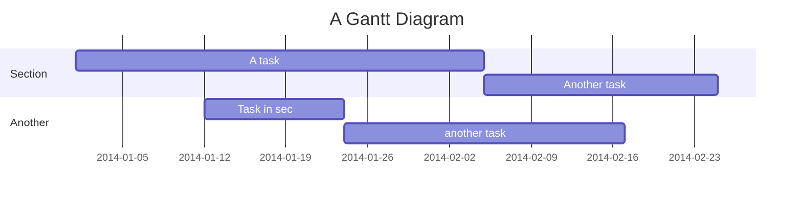
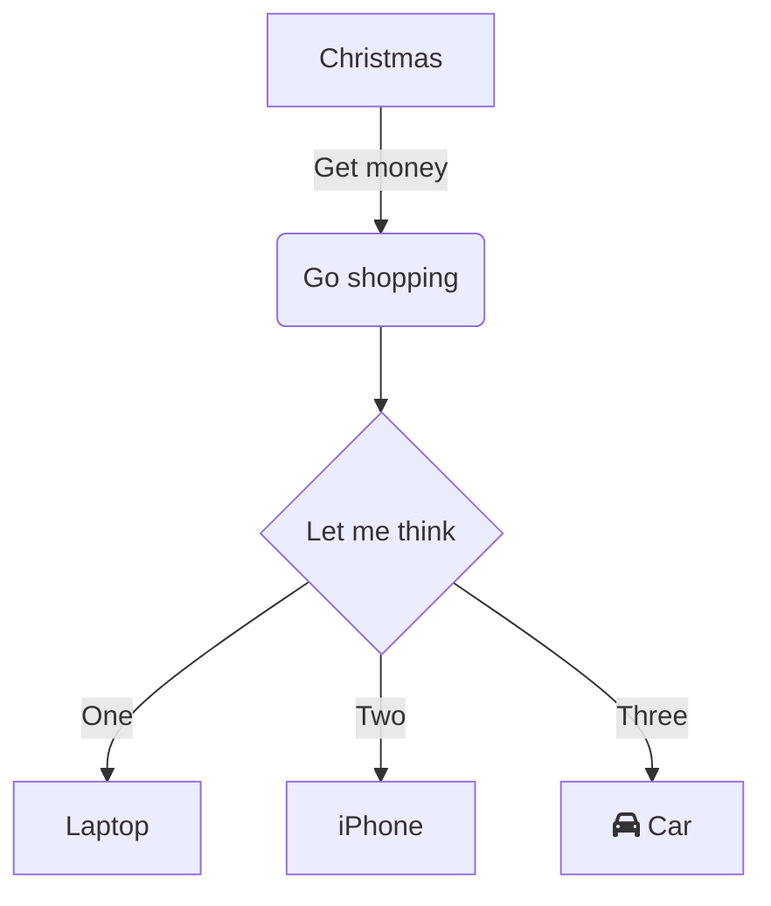
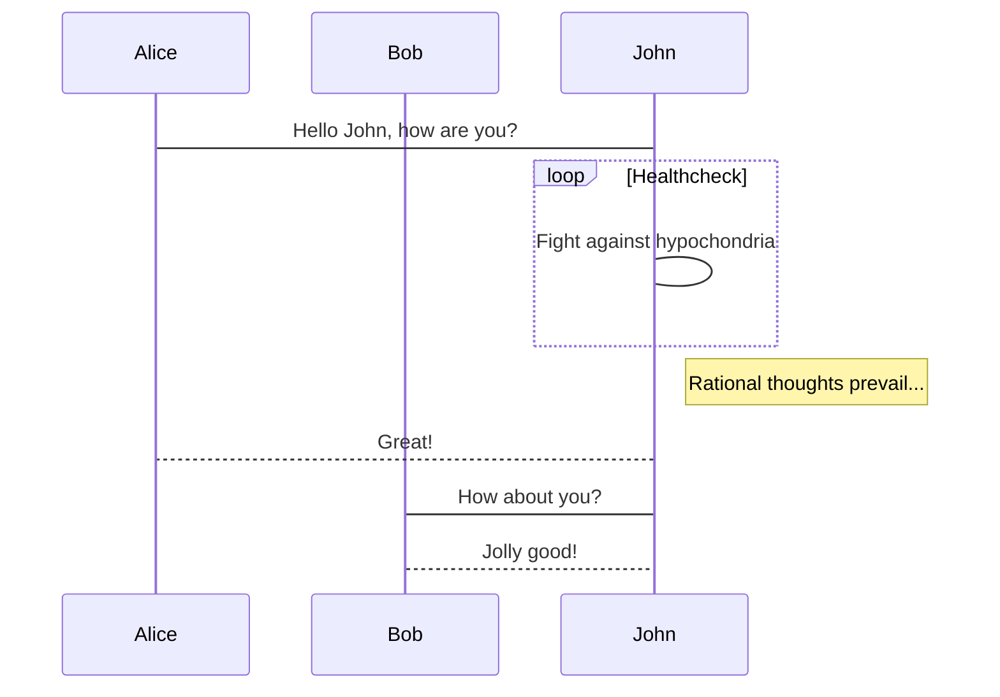

```mermaid

gantt
    title A Gantt Diagram
    dateFormat  YYYY-MM-DD

    section Section

    A task           :a1, 2014-01-01, 35d

    Another task     :after a1  , 20d

    section Another

    Task in sec      :2014-01-12  , 12d

    another task      : 24d
```

```mermaid

pie title Pets adopted by volunteers

    "Dogs" : 386

    "Cats" : 85

    "Rats" : 15
```

```mermaid

flowchart TD

    A[Christmas] -->|Get money| B(Go shopping)

    B --> C{Let me think}

    C -->|One| D[Laptop]

    C -->|Two| E[iPhone]

    C -->|Three| F[fa:fa-car Car]
```

#### sequence

```mermaid
sequenceDiagram
    participant Alice
    participant Bob
    Alice->John: Hello John, how are you?
    loop Healthcheck
        John->John: Fight against hypochondria
    end
    Note right of John: Rational thoughts prevail...
    John-->Alice: Great!
    John->Bob: How about you?
    Bob-->John: Jolly good!
```

